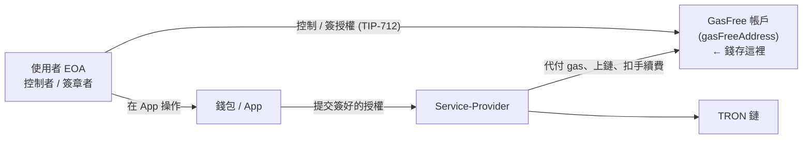

# 01 · 概念總覽

> 對象:PM / 產品 / 所有要碰 GasFree 的人。讀完你會知道 GasFree 是什麼、為什麼用、有哪些角色與限制。

## 為什麼需要 GasFree

在 TRON 上轉 USDT 這類 TRC-20 代幣,使用者必須持有 **TRX** 來付 gas(能量/頻寬)。對新使用者很不友善:「我只想轉 USDT,為什麼還要先去買 TRX?」

**GasFree 解決這件事**:使用者轉代幣時不需要 TRX。Service-Provider 幫忙代付 gas 上鏈,然後**從使用者轉的代幣裡扣一筆手續費**當作補償。對使用者來說 = 「用 USDT 付手續費,不用碰 TRX」。

## 四個角色

| 角色                 | 職責                                                                                                       |
| -------------------- | ---------------------------------------------------------------------------------------------------------- |
| **使用者(EOA)**      | 持有私鑰,對轉帳授權做 TIP-712 簽名。是 GasFree 帳戶的控制者。                                              |
| **GasFree 帳戶**     | 依特定演算法由 EOA 衍生的地址,**實際持有並轉出代幣**。                                                     |
| **Service-Provider** | 收集使用者簽好的授權、代付 TRX gas、提交上鏈;成功後從代幣扣手續費。可有多個 Provider。                     |
| **錢包 / App**       | 提供 UI:查 GasFree 帳戶資產、組授權、引導使用者簽名、提交給 Provider、追蹤狀態。**這就是我們要做的部分。** |

## Service-Provider:白名單機制與兩種參與角色

> 常見誤解:以為可以「自己新增一個 GasFree provider」。**不行** —— provider 是鏈上白名單,不是設定值。

GasFree 由 **JustLend DAO** 營運,核心是鏈上的 `GasFreeController` 合約(即簽章 domain 的 `verifyingContract`)。

- 協定**設計上支援多個 Provider**,`GET /config/provider/all` 會列出可用清單。
- 但每筆 permit 的 `serviceProvider` 欄位會在**鏈上被驗證**是否為已註冊的 provider,不符就回 `ProviderAddressNotMatchException`。也就是 **provider 是合約層白名單**。
- 目前主網/測試網都只有**官方註冊的那一個 provider**,所以 `provider/all` 只回一個。
- **沒有公開的「自助註冊 provider」流程**;要成為 provider 需鏈上註冊 + 自建代付 relayer,並由官方審核,得直接聯繫 GasFree / JustLend 團隊。

兩種「參與 GasFree」的角色,別搞混:

| 角色                    | 要做什麼                                                                             | 開放程度                 | 我們是哪種            |
| ----------------------- | ------------------------------------------------------------------------------------ | ------------------------ | --------------------- |
| **整合方 / API 消費者** | 申請 API Key/Secret,從 `provider/all` 選一個既有 provider,透過它送出授權             | **開放**(開發者申請即可) | ✅ 這就是我們         |
| **Provider 營運方**     | 鏈上註冊 provider 地址、自建 relayer(持 TRX 代付 gas、收授權、上鏈、設費率/deadline) | **權限控管、非自助**     | ❌ 一般不需要也加不了 |

> 👉 **對我們的產品**:99% 情況**不需要自己跑 provider**,直接當整合方用官方既有 provider 即可(我們後端就是這樣做)。只有想自己掌控 relayer 與手續費經濟模型時,才需要去爭取成為註冊 provider。

## 一筆 GasFree 轉帳發生了什麼(高層)

1. 使用者的代幣在 **GasFree 帳戶**裡(不是 EOA —— 見 [02](./02-accounts-and-funds.md))。
2. App 查詢帳戶資訊(餘額、nonce、是否啟用)。
3. 使用者填收款人 + 金額,App 組出 `PermitTransfer` 授權。
4. 使用者用 EOA 私鑰**簽 TIP-712**。
5. App 把簽名 + 參數送給 Provider(經我們後端)。
6. Provider 驗證 → 代付 gas → 上鏈,從 GasFree 帳戶扣「金額 + 手續費」。
7. App 用回傳的 `traceId` 追蹤直到 `SUCCEED`。

## 能做 / 不能做

✅ **可以**

- 不持有 TRX 也能把 GasFree 帳戶裡的 TRC-20 轉出去。
- 用任何能做 EIP-712 簽章的錢包整合(不限 TronLink) —— 見 [04](./04-app-integration.md)。
- 支援多個代幣(由 Provider 設定的支援清單決定)與多個 Provider。

❌ **不行 / 限制**

- **GasFree 帳戶沒餘額就轉不了**,即使 EOA 有錢也一樣(GasFree 轉帳扣的是 GasFree 帳戶)。
- 目前只在 **TRON**(主網 + Nile 測試網),之後才會擴到其他 EVM 鏈。
- 同一帳戶通常**同時只能有一筆 pending** 的授權(由 Provider 的 `maxPendingTransfer` 決定,目前為 1)。
- 手續費**以被轉的代幣計價**(如 USDT),會隨 Provider 設定調整。
- 不支援的代幣若被轉進 GasFree 帳戶,需透過提取頁面/流程提回 EOA。

## 環境(網路)

| 網路                  | 用途      | chainId                     | Provider host                  |
| --------------------- | --------- | --------------------------- | ------------------------------ |
| **Nile 測試網**(預設) | 開發/聯調 | `3448148188` (`0xcd8690dc`) | `https://open-test.gasfree.io` |
| **主網**              | 正式      | `728126428` (`0x2b6653dc`)  | `https://open.gasfree.io`      |

> ⚠️ **強烈建議正式上線後對一般使用者關閉測試網入口**,避免使用者填錯收款地址造成資產損失(GasFree 官方建議)。

下一步:[02 帳戶模型與資金流](./02-accounts-and-funds.md)。
