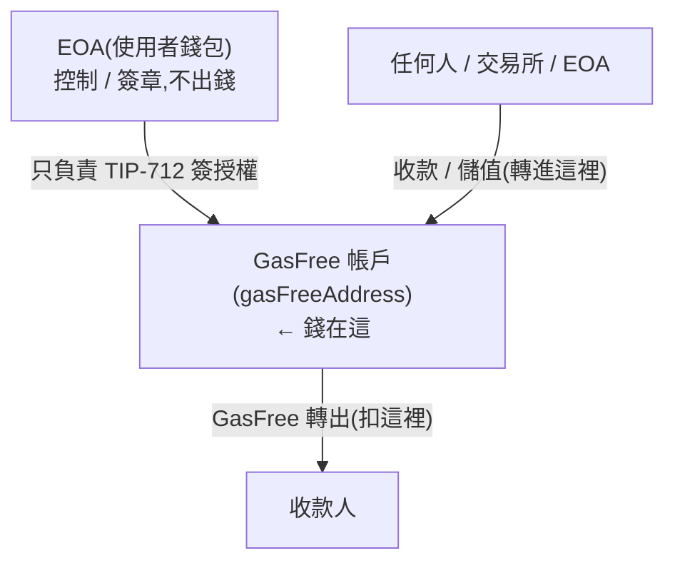
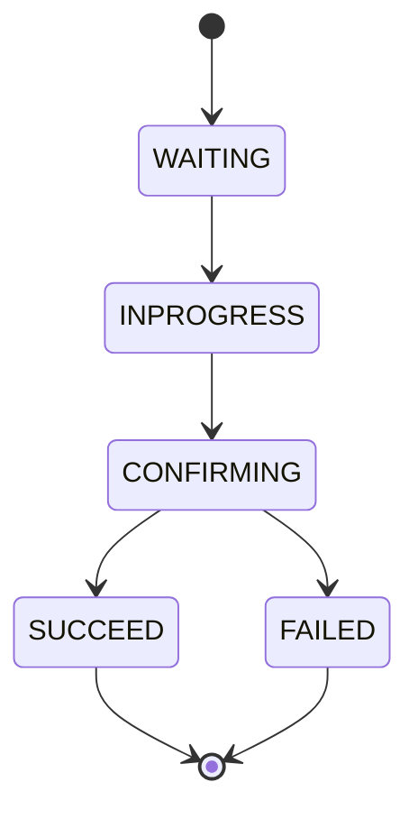
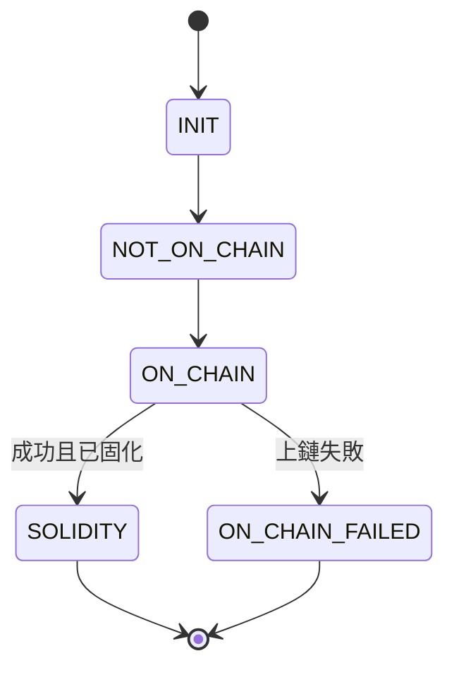

# 02 · 帳戶模型與資金流

> 對象:PM + App。這是 GasFree 最容易誤解的部分,務必讀懂。

## 核心心智模型:EOA 控制、GasFree 帳戶持有



- **EOA**(`accountAddress`)= 使用者的一般 TRON 地址,只是 GasFree 帳戶的**控制者 / 簽章者**。它自己的代幣餘額**不參與** GasFree 轉帳。
- **GasFree 帳戶**(`gasFreeAddress`)= 由 EOA 衍生、實際**存錢與扣錢**的地址。GasFree 轉帳 = 從這裡轉出,手續費也從這裡扣。

`gasFreeAddress` 由 GasFree 的 `GET /address/{eoa}` 直接回傳(不需要自己在 client 算),且與 EOA 一一對應。

## 最重要的兩個結論(常見誤解)

> **Q1:GasFree 帳戶沒錢,但我 EOA 錢包有錢,能轉嗎?**
> ❌ **不能。** GasFree 轉帳扣的是 **GasFree 帳戶**的餘額,跟 EOA 餘額無關。GasFree 帳戶該代幣不足 → Provider 直接回 `InsufficientBalanceException`。

> **Q2:EOA 要轉的錢會自動先進 GasFree 帳戶,再從 GasFree 帳戶轉出嗎?**
> ❌ **不會自動。** GasFree 不會去動 EOA 的錢(它沒有 EOA 的轉出授權)。GasFree 帳戶的錢來源只有一個:**有人把代幣轉進那個 `gasFreeAddress`**。

## GasFree 帳戶怎麼有錢

`gasFreeAddress` 本質就是一個**收款地址**。讓它有餘額:

1. **(主要用法)直接收款到 GasFree 帳戶** — 把 `gasFreeAddress` 當作使用者的收款地址給交易所/他人提幣。錢進來後,從這裡花出去都不需要 TRX。
2. **從 EOA 轉進去** — 這是一筆**普通 TRC-20 轉帳,要 EOA 付 TRX gas**,本身不屬於 GasFree 流程(若 EOA 沒 TRX 就做不了)。

> 👉 **產品設計重點**:要讓使用者享受到 GasFree,App 給對方/交易所的**收款地址應該是 `gasFreeAddress`**,而不是 EOA。這樣資金累積在能 gas-free 花用的地方。

## 啟用(Activation)

- GasFree 帳戶預設**未啟用(`active: false`)**。
- **第一次**轉出會自動啟用,並額外收一次 **`activateFee`**(代幣計價,從 GasFree 帳戶扣)。
- 之後每筆只收 **`transferFee`**。

## 手續費計算

手續費都以**被轉的代幣**計價(如 USDT),單位是該代幣最小單位(smallest unit)。

```
maxFee = transferFee + (active ? 0 : activateFee)
```

- `transferFee` / `activateFee` 來自 `GET /config/token/all` 或 `GET /address/{eoa}` 的 `assets`。
- `maxFee` 是「使用者願意支付的手續費上限」,簽進授權。實際扣多少由 Provider 上鏈後結算(`txnTotalFee`),但不會超過 `maxFee`。
- **送出前要確認**:`GasFree 帳戶餘額 ≥ value + maxFee`,否則會 `MaxFeeExceededException` / `InsufficientBalanceException`。

## 餘額與可轉上限(務必照做)

GasFree `GET /address/{eoa}` 回傳的 `assets[].frozen` = 該代幣**進行中(pending)**的金額(含手續費)。要正確算可轉上限:

```
可轉上限 ≈ gasFreeAddress 的鏈上代幣餘額 − frozen
要能送出:value + maxFee ≤ 可轉上限
```

> ⚠️ App 應**從鏈上查 `gasFreeAddress` 的最新代幣餘額**,再結合 `frozen`,才能準確擋下「餘額不足」的送出。光靠 API 不夠,因為鏈上餘額會即時變動。

## 一次只能一筆 pending

- `GET /address/{eoa}` 回傳 `allowSubmit`:目前是否允許再提交授權。
- Provider 的 `config.maxPendingTransfer`(目前 = 1)限制同時 pending 的授權數。必須等前一筆上鏈成功才能送下一筆。
- App 在 `allowSubmit === false` 時應 disable 送出並提示「有一筆轉帳進行中」。

## nonce

- `GET /address/{eoa}` 回傳推薦的 `nonce`。
- **一定要用 API 回傳的 nonce**,不要自己用鏈上 nonce —— 因為可能有 pending 的授權還沒上鏈,後端會綜合鏈上與佇列給出正確值。錯的 nonce → `NonceNotMatchException`。

## 狀態機

**授權狀態(`state`)** — 一筆 GasFree 授權的生命週期:



**鏈上交易狀態(`txnState`)** — 上鏈後才有值,之前為 null:



App 用 `submit` 回傳的 `traceId` 呼叫 `GET /gasfree/{traceId}` 輪詢,直到 `state = SUCCEED`(且 `txnState = SOLIDITY`)或 `FAILED`。

## 提取不支援的代幣

若有 Provider **不支援**的代幣被轉進 GasFree 帳戶,使用者無法用 GasFree 轉出它,需透過 GasFree 官方提取頁面(`https://gasfree.io/withdraw`)或等同機制提回 EOA。App 可視需求自建提取流程。

下一步:後端看 [03 後端串接](./03-backend-integration.md);App 看 [04 App 串接](./04-app-integration.md)。
