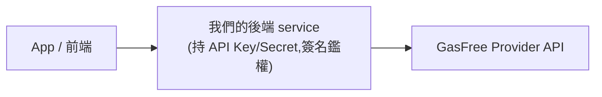

# 03 · 後端串接

> 對象:後端。說明我們如何把 GasFree Provider API 包成內部服務,以及鑑權、網路、錯誤處理。

## 為什麼一定要有後端這層

GasFree Provider API 需要 **API Key + API Secret** 做 HMAC-SHA256 簽名鑑權。**Secret 絕對不能放到 client(App / 前端)**。因此:



App 永遠呼叫**我們的後端**,後端再代為呼叫 GasFree。

## 程式碼分層(`packages/api/src/orpc`)

| 層           | 檔案                            | 職責                                                                                                               |
| ------------ | ------------------------------- | ------------------------------------------------------------------------------------------------------------------ |
| **contract** | `contracts/gasfree.contract.ts` | oRPC 合約:每個端點的 input/output(重用 pipe schema)、REST route metadata                                           |
| **route**    | `routes/gasfree.route.ts`       | 薄 handler:取出 input、呼叫 service、掛錯誤映射 middleware                                                         |
| **service**  | `services/gasfree.service.ts`   | 商業邏輯入口:`getAllTokens / getAllProviders / getAccountInfo / submitTransfer / getTransferDetail`,皆帶 `network` |
| **repo**     | `repos/gasfree.repo.ts`         | `gasFreeRequest`:組 HMAC headers、依 network 解析 host/prefix、發 HTTP、用 pipe 驗證/轉換回應                      |
| **pipe**     | `pipes/gasfree.pipe.ts`         | 所有 zod schema 與型別(請求/回應/列舉)                                                                             |
| **utils**    | `utils/gasfree.ts`              | `GASFREE_NETWORKS` 對應表、`DEFAULT_GASFREE_NETWORK`、`GasFreeApiError`                                            |

## 端點(對外)

router 同時掛兩種 handler:

| 協定              | 前綴           | 適合                                                |
| ----------------- | -------------- | --------------------------------------------------- |
| **RPC**           | `/api/v1/rpc`  | 型別安全的 oRPC client(前端 / RN 用 `@orpc/client`) |
| **REST(OpenAPI)** | `/api/v1/rest` | 一般 REST / 第三方串接                              |

procedure 對應(RPC 走 router 路徑;REST 走 contract `.route()` 的 path):

| Procedure                  | REST                                         | 說明                    |
| -------------------------- | -------------------------------------------- | ----------------------- |
| `gasfree.config.tokens`    | `GET /rest/gasfree/config/tokens`            | 支援的代幣清單          |
| `gasfree.config.providers` | `GET /rest/gasfree/config/providers`         | 可用 Provider 清單      |
| `gasfree.account`          | `GET /rest/gasfree/address/{accountAddress}` | 使用者 GasFree 帳戶資訊 |
| `gasfree.submit`           | `POST /rest/gasfree/submit`                  | 提交簽好的授權          |
| `gasfree.trace`            | `GET /rest/gasfree/{traceId}`                | 查授權後續狀態          |

詳細欄位見 [05 API 參考](./05-api-reference.md)。

> Provider 是**鏈上白名單**、不能自行新增(見 [01 · Service-Provider](./01-overview.md));`config.providers` 目前只會回官方那一個。我們是「整合方」,選清單裡的 provider(通常 `providers[0]`)當作授權的 `serviceProvider`。

## 網路(network)是必帶參數

**每個** procedure 的 input 都含 `network`(`"mainnet" | "nile"`),由 client 指定要打哪個網路。後端用它解析 host 與簽名 path 前綴:

```ts
// packages/api/src/orpc/utils/gasfree.ts
export const GASFREE_NETWORKS = {
  mainnet: { baseUrl: "https://open.gasfree.io", pathPrefix: "/tron" },
  nile: { baseUrl: "https://open-test.gasfree.io", pathPrefix: "/nile" },
};
export const DEFAULT_GASFREE_NETWORK = "nile";
```

> ⚠️ **三邊一致**:client 帶的 `network`、簽章 domain 的 `chainId`/`verifyingContract`、以及資金所在網路,必須是同一個。任一不一致 → 簽章無效或提交被拒(見 [04](./04-app-integration.md))。

## 鑑權(HMAC-SHA256)

`repos/gasfree.repo.ts` 的 `createGasFreeHeaders` 對 `{method}{signedPath}{timestamp}` 用 API Secret 做 HMAC-SHA256、base64:

```
Timestamp: <unix 秒>
Authorization: ApiKey {api_key}:{base64(HMAC_SHA256(secret, METHOD + PATH + TIMESTAMP))}
```

- **簽名的 path 必須含網路前綴**(如 `/nile/api/v1/...`),且與實際請求 URL 一致。
- 每個網路可用不同金鑰:主網用 `GF_API_KEY/GF_API_SECRET`,測試網優先用 `TEST_GF_API_KEY/TEST_GF_API_SECRET`(沒設則 fallback 主網那組)。

### 環境變數(`packages/api/src/orpc/env.ts`)

| 變數                 | 必填     | 說明                                  |
| -------------------- | -------- | ------------------------------------- |
| `GF_API_KEY`         | ✅       | 主網 API Key                          |
| `GF_API_SECRET`      | ✅       | 主網 API Secret                       |
| `TEST_GF_API_KEY`    | optional | Nile 測試網 API Key(未設則用主網那組) |
| `TEST_GF_API_SECRET` | optional | Nile 測試網 API Secret                |

> 金鑰需向 GasFree 開發者中心申請;審核久未過可寄 User Id 給 `admin@gasfree.io`。

## 回應驗證與錯誤處理

GasFree **一律回 HTTP 200**,成敗放在 body:`{ code, reason, message, data }`(`code` 200 成功 / 400 輸入錯 / 500 執行錯)。

- `repo` 用 `pipe.BaseResponse` 驗外層,再用各 data schema `.parse()`(同時做欄位轉換,例如 submit 回應的 `estimateTransferFee` → `estimatedTransferFee`)。
- `code !== 200` 或 `data == null` → 丟 `GasFreeApiError(code, reason, message)`。
- `routes` 掛 `gasfreeErrorMw`(在 `utils.ts`)把 `GasFreeApiError` 映射成 `ORPCError`:
  - `code 400 → BAD_REQUEST`,`500 → INTERNAL_SERVER_ERROR`
  - 原始異常名放在 **`data.reason`**(如 `DeadlineExceededException`、`NonceNotMatchException`、`InsufficientBalanceException`),讓 client 可據此分支提示。

常見 `reason`(submit 階段):

| reason                             | 意義                  |
| ---------------------------------- | --------------------- |
| `ProviderAddressNotMatchException` | 服務商地址不匹配      |
| `DeadlineExceededException`        | 授權已過期            |
| `InvalidSignatureException`        | 簽章錯誤              |
| `UnsupportedTokenException`        | 代幣不支援            |
| `TooManyPendingTransferException`  | pending 授權過多      |
| `VersionNotSupportedException`     | 簽章版本不支援        |
| `NonceNotMatchException`           | nonce 不匹配          |
| `MaxFeeExceededException`          | 預估手續費超過 maxFee |
| `InsufficientBalanceException`     | GasFree 帳戶餘額不足  |
| `ValidationException`              | 帳戶被列入黑名單等    |

## 給 client 的整合方式

- **型別安全(建議 RN/前端)**:用 `@orpc/client` + `RPCLink` 指向 `<host>/api/v1/rpc`,搭配 `@orpc/tanstack-query` 拿到 query/mutation utils(可參考 `apps/www/src/lib/orpc.ts`)。
- **一般 REST**:打 `/api/v1/rest/...`,適合非 JS 端或第三方。

## 注意

- `gasfree.account` 的 `accountAddress` 目前用 `z.string()`(地址格式交上游驗),`gasfree.trace` 的 `traceId` 用 `z.uuid()`。
- `submit` 是**會觸發鏈上交易**的寫入操作;之後若要加 rate limit / 額外授權,建議只掛在 submit,別套到唯讀查詢。
- config 類(tokens/providers)變動少,可加短 TTL 快取以減少對 Provider 的請求。
