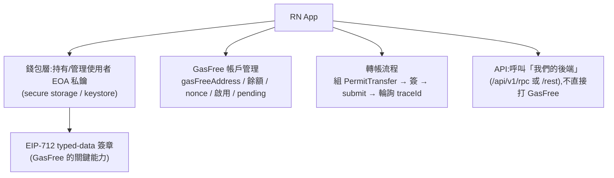
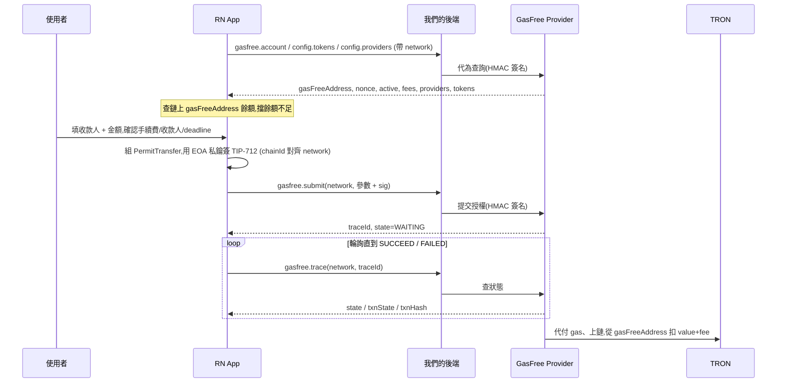

# 04 · App 串接(React Native)

> 對象:App 工程師。重點:**GasFree 帳戶管理** 與 **GasFree permit 簽章機制**,以及在 RN(我們自有錢包 App)該怎麼接。

先讀過 [02 帳戶模型與資金流](./02-accounts-and-funds.md),這裡假設你已理解「EOA 控制、GasFree 帳戶持有」。

## 整體架構



> ⚠️ **不要在 App 裡放 GasFree 的 API Key/Secret**。所有 GasFree 呼叫一律經我們的後端(見 [03](./03-backend-integration.md))。App 只需要呼叫我們後端的 5 個端點。

## 關鍵前提:我們自有錢包 ⇒ 自己簽 permit

我們在 demo 階段發現:**第三方錢包(TronLink / OKX / TokenPocket…)會擋掉「外部 dApp 請求 GasFree permit 簽章」**(TronLink 會回 `does not support permit transfer requests from a third party`),這是錢包端的防釣魚政策。

但**我們自己的 RN App 持有使用者私鑰**,所以**直接自己簽** EIP-712 即可 —— 不依賴外部錢包、不受這個限制、也不會有「網路不一致導致 fallback 本地簽 → invalid private key」的問題。這正是自有錢包接 GasFree 的正確做法。

> 換句話說:在 RN 自有錢包裡,「連哪個外部錢包」不是問題 —— 簽章由 App 自己用持有的私鑰完成。

## GasFree permit 簽章機制(核心)

GasFree 授權是一份 **TIP-712(= TRON 版 EIP-712)typed-data**,由使用者 EOA 私鑰簽名,鏈上由 `GasFreeController` 合約驗章。

### Domain(隨網路不同)

```ts
{
  name: "GasFreeController",
  version: "V1.0.0",
  chainId,            // nile: 3448148188 / mainnet: 728126428
  verifyingContract,  // nile: THQGuFzL87ZqhxkgqYEryRAd7gqFqL5rdc
                      // mainnet: TFFAMQLZybALaLb4uxHA9RBE7pxhUAjF3U
}
```

### Types(固定)

```ts
{
  PermitTransfer: [
    { name: "token",           type: "address" },
    { name: "serviceProvider", type: "address" },
    { name: "user",            type: "address" },  // ← EOA,不是 gasFreeAddress
    { name: "receiver",        type: "address" },
    { name: "value",           type: "uint256" },
    { name: "maxFee",          type: "uint256" },
    { name: "deadline",        type: "uint256" },
    { name: "version",         type: "uint256" },
    { name: "nonce",           type: "uint256" },
  ],
}
```

### Message(每筆組出來)

| 欄位              | 來源 / 算法                                                     |
| ----------------- | --------------------------------------------------------------- |
| `token`           | 選定代幣的合約地址                                              |
| `serviceProvider` | 選定 Provider 的地址(`providers[0].address`)                    |
| `user`            | 使用者 **EOA**(不是 gasFreeAddress)                             |
| `receiver`        | 收款地址                                                        |
| `value`           | 轉帳金額,**最小單位字串**(如 1.5 USDT → `"1500000"`)            |
| `maxFee`          | `transferFee + (active ? 0 : activateFee)`,最小單位字串         |
| `deadline`        | `floor(now/1000) + provider.config.defaultDeadlineDuration`(秒) |
| `version`         | `1`                                                             |
| `nonce`           | `account.nonce`(用 API 回傳值)                                  |

> `value` / `maxFee` / `deadline` 在 message 內是**字串**(uint256),`version` / `nonce` 是數字。簽完的 signature 去掉開頭 `0x` 再送 submit。

### 為什麼這套簽章是安全的

- 鏈上 `GasFreeController` 驗證簽章與所有欄位,簽錯/被竄改即失效。
- `nonce` 防重放;`deadline` 過期即無效;`maxFee` 限制手續費上限。
- 私鑰只在 App 安全環境用於簽章,**永不傳給 Provider**;Provider 只拿到 signature。

### 在 RN 怎麼簽

你需要一個「對 EIP-712 typed-data 用 secp256k1 私鑰簽名」的能力。可選:

- **`tronweb`**:`TronWeb.Trx._signTypedData(domain, types, message, privateKey)`(靜態方法,帶私鑰直接簽)。注意 RN 對 `tronweb` 的 polyfill(crypto、Buffer、BigInt)需處理。
- **自有/硬體簽章器**:對 EIP-712 digest 做 secp256k1 簽章(若已有 TRON 簽章基建,沿用即可)。
- 把簽章抽象成一個 `sign(message) => Promise<string>` callback,App 內部接自己的 keystore;流程其餘部分與錢包無關(方便日後換簽章來源)。

> demo(`apps/www`)用注入式 TronLink 簽,僅供瀏覽器展示;RN 自有錢包請走「自己持私鑰簽」這條,邏輯更單純也更穩。

## GasFree 帳戶管理(App 該做的事)

呼叫我們後端的 `gasfree.account`(`GET /address/{eoa}`)拿到帳戶狀態,並據此管理 UI:

| 來自 API         | App 用途                                                                                           |
| ---------------- | -------------------------------------------------------------------------------------------------- |
| `gasFreeAddress` | **當作使用者的「GasFree 收款地址」顯示** —— 收款/儲值要進這裡(見 [02](./02-accounts-and-funds.md)) |
| `active`         | 顯示是否已啟用;未啟用時提示「首筆轉帳會多收一次啟用費」                                            |
| `nonce`          | 組 PermitTransfer 用(務必用這個值)                                                                 |
| `allowSubmit`    | `false` 時 disable 送出,提示「有一筆轉帳進行中」                                                   |
| `assets[]`       | 各代幣的 `activateFee` / `transferFee` / `decimal` / `frozen`(進行中金額)                          |

**餘額顯示與可轉上限**:API 不直接給「鏈上餘額」,App 要**從鏈上查 `gasFreeAddress` 的代幣餘額**,再:

```
可轉上限 ≈ 鏈上餘額(gasFreeAddress, token) − frozen
送出條件:value + maxFee ≤ 可轉上限
```

不足就在送出前擋下並提示(否則會等到 submit 才被後端用 `InsufficientBalanceException` 退回)。

App 帳戶頁建議呈現:GasFree 收款地址(可複製/QR)、各代幣餘額、啟用狀態、是否有 pending、最近授權的狀態(由 traceId 追蹤)。

## 端到端轉帳流程



組授權與計算(對齊 [02](./02-accounts-and-funds.md)):

1. `maxFee = transferFee + (active ? 0 : activateFee)`
2. `deadline = floor(now/1000) + provider.config.defaultDeadlineDuration`
3. `nonce = account.nonce`、`serviceProvider = providers[0].address`、`user = EOA`
4. 簽 → `submit` → 拿 `traceId` → 輪詢 `trace`。

## 安全檢查清單

- [ ] **私鑰**只存在裝置安全儲存(Keychain / Keystore / Secure Enclave),簽章在安全環境進行。
- [ ] **絕不**把私鑰或 GasFree API Secret 放進 App bundle 或傳給後端/Provider。
- [ ] 簽 permit 前在 UI **明確顯示**:收款地址、金額、預估手續費(上限)、deadline、網路 —— 因為 permit 等於授權動用 GasFree 帳戶資金。
- [ ] 簽章 `chainId`/`verifyingContract` 必須對齊使用者選的 `network`,且與後端 `network`、資金所在網路一致。
- [ ] 送出前做餘額/`frozen`/`allowSubmit` 檢查,避免無謂的失敗。
- [ ] 收款地址預設給 **`gasFreeAddress`**,不是 EOA。
- [ ] 正式版預設**主網**,測試網入口對一般使用者隱藏。

## RN 實作注意

- TRON 簽章/編碼會用到 `crypto`、`Buffer`、`BigInt`、base58 等;在 RN 需要對應 polyfill(視所選函式庫而定)。建議把簽章與 GasFree 帳戶邏輯抽成獨立模組並寫測試。
- 與後端往來建議用 `@orpc/client`(型別安全),或一般 REST(`/api/v1/rest`)。

## 跟 demo 的對照(`apps/www`,供參考)

| demo 檔案                                              | RN 對應做法                                                         |
| ------------------------------------------------------ | ------------------------------------------------------------------- |
| `lib/orpc.ts`                                          | 一樣可用 `@orpc/client` 指向後端 `/api/v1/rpc`                      |
| `hooks/use-gasfree.ts`                                 | 同樣的 query/mutation(tokens/providers/account/submit),帶 `network` |
| `lib/gasfree.ts`(domain/types/message/maxFee/單位換算) | **可直接沿用**邏輯(EIP-712 domain、PermitTransfer、`toBaseUnits`)   |
| `lib/tron.ts`(注入式 TronLink 簽)                      | **改成 App 自有私鑰簽**(換掉簽章來源即可)                           |
| `stores/wallet.ts`(連 TronLink)                        | 改成 App 自有錢包/帳號管理                                          |

下一步:欄位細節見 [05 API 參考](./05-api-reference.md)。
